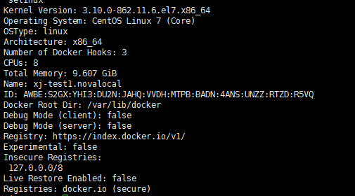

## 安装

### CentOS7 

> Docker 运行在 CentOS 7 上，要求系统为64位、系统内核版本为 3.10 以上。查看内核 `uname -r`


1. 添加yum 源

```
yum install epel-release –y
yum clean all
yum list
```

2.安装并运行docker

```
yum install docker-io –y
systemctl start docker
```

3.检查安装结果

```
docker info
```

如果出现以下信息则表明安装成功

 

### Docker基本用法

1.Docker守护进程管理
```
systemctl start docker     #运行Docker守护进程
systemctl stop docker      #停止Docker守护进程
systemctl restart docker   #重启Docker守护进程
```

2.镜像管理。本文使用的是来自阿里云仓库的Apache镜像。
   - 查看已有镜像
   
   ``` docker images```
   
   - 删除镜像
   
   ``` docker rmi –f XXXXX```