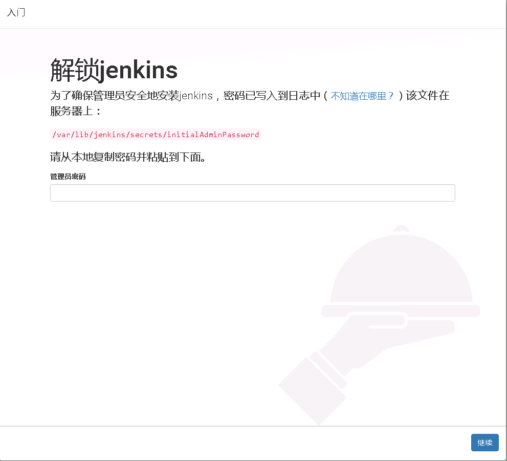

# Jenkins
> Jenkins 是一个开源软件项目，是基于Java开发的一种持续集成工具，用于监控持续重复的工作，旨在提供一个开放易用的软件平台，使软件的持续集成变成可能。

# 安装 (centOS7)
* [下载地址](https://jenkins.io/download/)

   ### yum
   
   1. 拉取库的配置到本地文件
   
   `wget -O /etc/yum.repos.d/jenkins.repo http://pkg.jenkins-ci.org/redhat/jenkins.repo `
   
   LTS 版本有点点不同
   
   `wget -O /etc/yum.repos.d/jenkins.repo http://pkg.jenkins-ci.org/redhat-stable/jenkins.repo`
   
   2. 导入公钥
   
   `rpm --import https://jenkins-ci.org/redhat/jenkins-ci.org.key`
   
   3. 安装
   
   `yum install jenkins`
   
   查找安装路径
   
   `rpm -ql jenkins`
   
   >jenkins相关目录释义：
   
   >+ /usr/lib/jenkins/：jenkins安装目录，war包会放在这里。
   >+ /etc/sysconfig/jenkins：jenkins配置文件，"**端口**"，"JENKINS_HOME"等都可以在这里配置。
   >+ /var/lib/jenkins/：默认的JENKINS_HOME。
   >+ /var/log/jenkins/jenkins.log：jenkins日志文件。
   
   4. 运行   `systemctl restart jenkins`
   
   ### 下载java包 (.war)
   
   ```
   mkdir -p /usr/local/jenkins/ && \
   wget -c -O /usr/local/jenkins/jenkins.war http://mirrors.jenkins.io/war-stable/latest/jenkins.war &&\
   nohup java -jar /usr/local/jenkins/jenkins.war &
   ```

# 配置

> jenkins 默认端口是8008

192.168.1.1:8080



接下来安装插件并创建admin账号

# 设置域名访问

## Nginx反向代理

* [官网介绍](https://wiki.jenkins.io/display/JENKINS/Jenkins+behind+an+NGinX+reverse+proxy)


官网给的SSl例子

`return 301 https://$host$request_uri; `

在github 设置web hooks 会失败


我自己的例子

```
upstream jenkins {
       server 127.0.0.1:8080 fail_timeout=0;
}
server {
	listen 	80;
	server_name  www.jenkins.com;
	rewrite ^(.*) https://$server_name$1 permanent;
        #return 301 https://$host$request_uri;
}

server {
	listen       443 ssl;
	server_name  www.jenkins.com;

	ssl_certificate      /etc/cert/jenkins/2123456789.pem;
	ssl_certificate_key  /etc/cert/jenkins/2123456789.key;

	ssl_session_cache    shared:SSL:1m;
	ssl_session_timeout  5m;

	ssl_ciphers  HIGH:!aNULL:!MD5;
	ssl_prefer_server_ciphers  on;

	location / {
                proxy_set_header        Host $host:$server_port;
                proxy_set_header        X-Real-IP $remote_addr;
                proxy_set_header        X-Forwarded-For $proxy_add_x_forwarded_for;
                proxy_set_header        X-Forwarded-Proto $scheme;
                proxy_redirect http:// https://;
                proxy_pass              http://jenkins;
	}
}
```