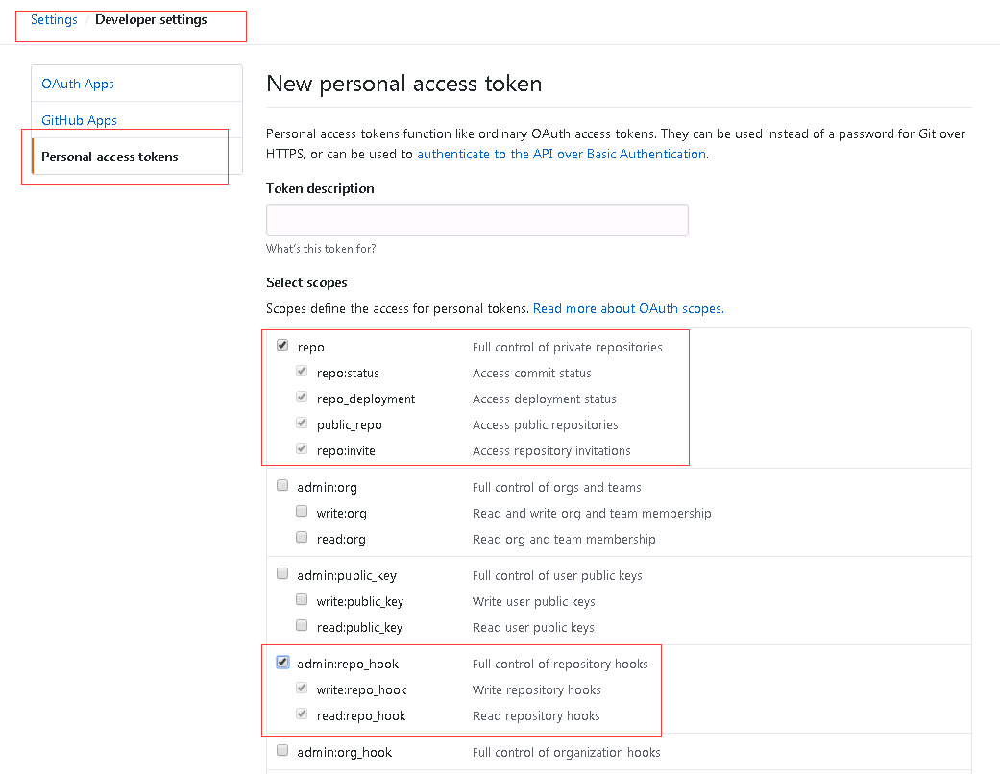
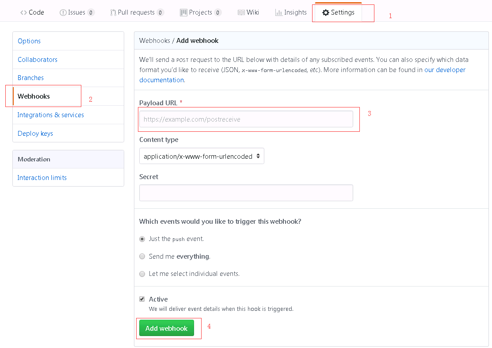
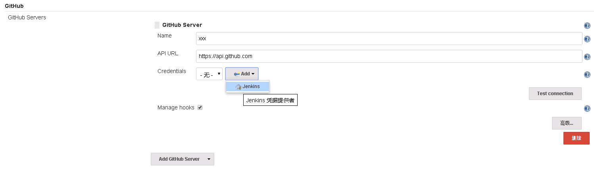
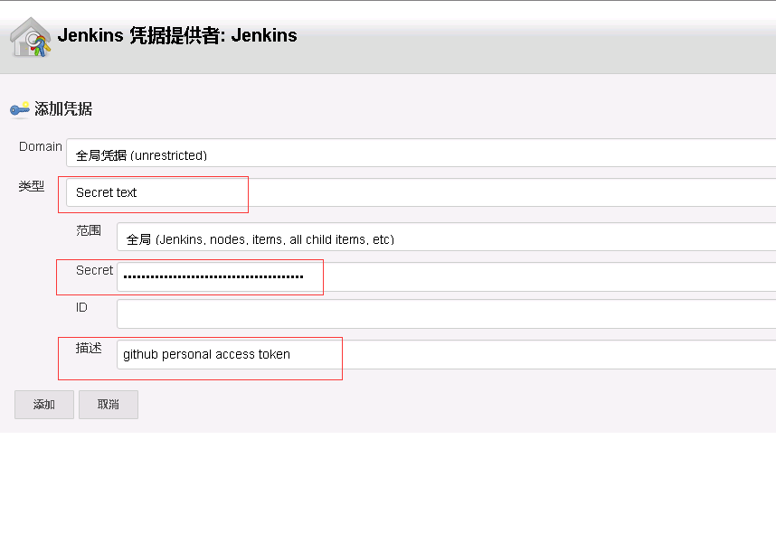
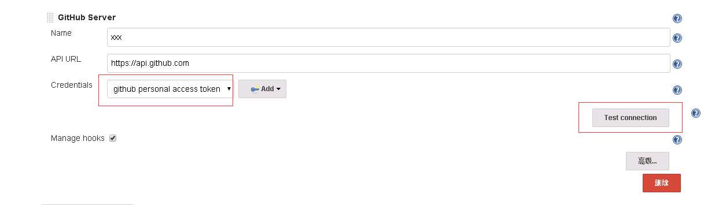
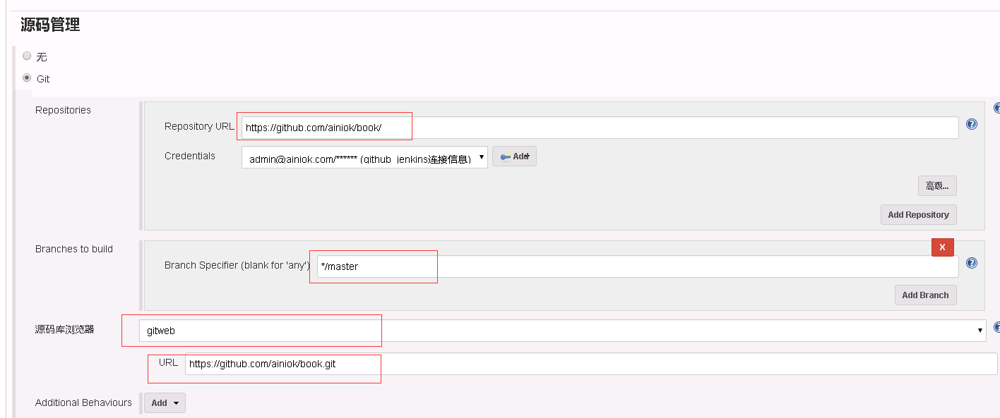

# 实战步骤

 - Github上有一个项目
 - Github 上配置jenkins 的webhook地址
 - Github 上创建一个access token
 
##  创建access token
 settings > Developer settings >Personal access token
 
 
 
 > **点击底部的”Generate token”按钮，就能产生一个新的access token，将此字符串复制下来，后面jenkins任务中会用**

## 配置 webhook
进入仓库

 

> webhook是通知Jenkins时的请求地址，用来填写到GitHub上，这样GitHub就能通过该地址通知到Jenkins； 
  假设Jenkins所在服务器的地址是：192.168.0.1，端口为8080，那么webhook地址就是http://192.168.0.1:8080/github-webhook
  
> **上述地址必须是外网也能访问的，否则GitHub无法访问到Jenkins**

## 配置 jenkins

#### 系统管理 > 系统设置 

 
 
 弹出的页面中，"类型"选择"Secret text"，"Secret"填入前面在GitHub上生成的Personal access tokens，Description随便写一些描述信息，如下图:
 
 
 
 "Credentials" 选择刚才添加的 "描述" ，点击右下的"Test connection"
 
 

## Github项目的主页和仓库地址
 地址栏的是项目主页 eg:https://github.com/ainiok/book
 
 仓库地址是： https://github.com/ainiok/book.git
 
 > **仓库地址一定是要https 不能是ssh**

## 新建任务
 构建一个自由风格的软件项目
 
 源码管理 选择git, 配置如下
 
 
 
 构建触发器选择  **GitHub hook trigger for GITScm polling**
 
 构建 > 添加构建步骤 > 执行shell 
 
 我的是构建gitbook项目,shell如下
 ```
gitbook install
gitbook build
/bin/cp -rf /var/lib/jenkins/workspace/book/* /var/www/book/
```
  
每次往github push代码到master 的时候就会自动构建


#遇到的问题
## 在线上的时候shell执行失败
更改jenkins运行身份

```$xslt
vim /etc/sysconfig/jenkins

# 修改 $JENKINS_USER="jenkins",去掉注释

$JENKINS_USER="root"
```

修改Jenkins相关文件夹权限

```
chown -R root:root /var/lib/jenkins
chown -R root:root /var/cache/jenkins
chown -R root:root /var/log/jenkins
```

重启服务

```
# 重启Jenkins（若是其他方式安装的jenkins则重启方式略不同）
systemctl restart jenkins
# 查看Jenkins进程所属用户
ps -ef | grep jenkins
# 若显示为root用户，则表示修改完

```

## 构建 Maven风格项目时

* 错误 `jenkins Error performing command: git ls-remote -h`

###安装Maven 

```$xslt
下载地址:  http://maven.apache.org/download.cgi
```

### 添加到环境变量

```
 vim /etc/profile
 
 export MAVEN_HOME=/usr/local/maven
 export PATH=$PATH:$MAVEN_HOME/bin
```

 执行 `source /etc/profile` 让配置生效
 
 查看版本 `mvn -version`

## git目录啥的(忘记了，有遇到的可以下方留言)
使用命令`whereis git`可以查看git安装目录

 
 安装 Phing  (构建PHP项目)  待定补充，还没操作过，有经验的可以联系我