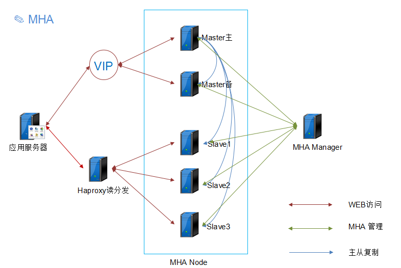

# 高可用及优化

# Oracle

## 高可用性

> "高可用性"（High Availability）通常来描述一个系统经过专门的设计，从而减少停工时间，而保持其服务的高度可用性。

 ### 主备（从）模式
 
 - 主机工作，备机处于监控准备状况；当主机宕机时，备机接管主机的一切工作，待主机恢复正常后，按使用者的设定以自动或手动方式将服务切换到主机上运行
 
 ### 主主模式
 
 - 两台主机同时运行各自的服务工作且相互监测情况，当任一台主机宕机时，另一台主机立即接管它的一切工作

 ### 集群模式
 
 - 多台主机一起工作，各自运行一个或几个服务，为每个服务定义一个或多个备用主机，当某个主机故障时，运行在其上的服务就可以被其它主机接管
 
 
 ## 负载均衡
 
 > "负载均衡"就是将服务（例如Web服务器、数据库服务器、企业关键应用服务器和其它关键任务服务器等）分摊到多个操作单元上进行，从而共同完成工作任务的机制。
 
 ### 软件负载均衡
 - 软件负载均衡解决方案是指在一台或多台服务器相应的操作系统上安装一个或多个附加软件来实现负载均衡，如DNS、Haproxy、LVS、Nginx等
 - 优点：基于特定环境，配置简单，使用灵活，成本低廉
 - 缺点：请求较大时会出现瓶颈，存在一定的安全风险，可扩展性差、受系统限制
 
 ### 硬件负载均衡
 - 两台主机同时运行各自的服务工作且相互监测情况，当任一台主机宕机时，另一台主机立即接管它的一切工作
 - 优点：性能和安全性上优于软件方式，辅助功能多样化且自带应用缓存等
 - 缺点：成本昂贵
 
 ## Oracle RAC
 
  

 ##  Oracle 双机热备

  
  
 ##  Oracle Data Guard

 
 
 
 #MySQL
 
 ## MySQL主从或主主半同步复制
 
  
  
  通常会和HProxy、Keepalived等第三方软件同时使用，即可以用来监控数据库的健康，又可以执行一系列管理命令。如果主库发生故障，切换到备库后仍然可以继续使用数据库。
  读写分离可以通过MyCAT等第三方软件或者应用程序代码读写分离来实现。
  
  **优点：**
  
 *  架构比较简单，使用原生半同步复制作为数据同步的依据；
 *  双节点，没有主机宕机后的选主问题，直接切换即可；
 *  双节点，需求资源少，部署简单；
  
  **缺点：**
 *  完全依赖于半同步复制，如果半同步复制退化为异步复制，数据一致性无法得到保证；
 *  需要额外考虑HAProxy、Keepalived的高可用机制;
 
 ## 高可用架构优化
 
 > 将双节点数据库扩展到多节点数据库，或者多节点数据库集群，一主多从或者多主多从的集群。由于半同步复制，存在接收到一个从机的成功应答即认为半同步复制成功的特性，所以多从半同步复制的可靠性要优于单从半同步复制的可靠性。并且多节点同时宕机的几率也要小于单节点宕机的几率，所以多节点架构在一定程度上可以认为高可用性是好于双节点架构。但由于数据库数量较多，所以需要数据库管理软件来保证数据库的可维护性。可以选择MMM、MHA或者各个版本的Proxy等。
 
 ### MHA
 
  
 
 > MHA Manager会定时探测集群中的master节点，当master出现故障时，它可以自动将最新数据的slave提升为新的master，然后将所有其他的slave重新指向新的master，整个故障转移过程对应用程序完全透明。
 
 工作原理如下：
 
 1. 从宕机崩溃的master保存二进制日志事件（binlog events）;
 2. 识别含有最新更新的slave；
 3. 应用差异的中继日志（relay log）到其他的slave；
 4. 应用从master保存的二进制日志事件（binlog events）；
 5. 提升一个slave为新的master；
 6. 使其他的slave连接新的master进行复制；
 
**优点：**
 * 可以进行故障的自动检测和转移；
 * 可扩展性较好，可以根据需要扩展MySQL的节点数量和结构；
 * 相比于双节点的MySQL复制，三节点/多节点的MySQL发生不可用的概率更低。
 
 **缺点：**
 * 至少需要三节点，相对于双节点需要更多的资源；
 * 逻辑较为复杂，发生故障后排查问题，定位问题更加困难；
 * 数据一致性仍然靠原生半同步复制保证，仍然存在数据不一致的风险；
 * 可能因为网络分区发生脑裂现象。
 
 ### zookeeper + MySQL-Proxy

 
 
 使用zookeeper可以有效的保证MySQL-Proxy的高可用性，可以较好地避免MySQL-Proxy的单点故障。
 
 应用程序在建立数据库连接池之前，从zookeeper中去取真实的数据库URL，如果有多个URL，采用随机算法获取连接。当连接不可用时，数据库连接池将重建连接，这时候获取zookeeper连接，就不能获取已经失效的url。
 
 
 **优点：**
 * 较好的保证了整个系统的高可用性，包括MySQL-Proxy、MySQL；
 * 扩展性较好，可以扩展为大规模集群。
 
 **缺点：**
 * 数据一致性仍然依赖于原生的MySQL半同步复制；
 * 引入ZK，整个系统的逻辑变得更加复杂。
 
 ### MMM
 
 [查看详情](https://www.cnblogs.com/trymybesttoimp/p/6479805.html)
 
 
 
 
 ##MySQL分布式集群架构
 
 MySQL分布式集群架构可以很好地解决主从复制的单主的弊端，常见的集群架构如右边列表所示。
         
 目前MySQL分布式集群架构已经越来越流行，越来越被大规模使用，俨然成为MySQL高可用的主流发展方向。
 
 另外MySQL Galera Cluster是抄袭PXC的，原理跟PXC一样。
 
 ### Percona XtraDB Cluster和MySQL Galera Cluster
 
 
 
 Percona XtraDB Cluster的实现是在原MySQL代码上通过Galera包将不同的mysql实例连接起来，实现了multi-master的集群架构。
 
 当有客户端要写入或者读取数据时，随便连接哪个实例都是一样的，读到的数据是相同的，写入某一个节点之后，集群自己会将新数据同步到其它节点上面，这种架构不共享任何数据，是一种高冗余架构。
 
 **优点：**
 * 当执行一个查询时，在本地节点上执行；
 * 因为所有数据都在本地，无需远程访问；
 * 无需集中管理，可以在任何时间点失去任何节点，但是集群将照常工作；
 * 良好的读负载扩展，任意节点都可以查询。
 
 **缺点：**
 * 加入新节点，开销大，需要复制完整的数据；
 * 所有的写操作都将发生在所有节点上，成倍增加写压力；
 * 只能支持Innodb和XtraDB引擎；
 * 有多少个节点就有多少重复的数据。

### MySQL Cluster

> MySQL Cluster是官方集群的部署方案，通过使用NDB存储引擎实时备份冗余数据，实现数据库的高可用性和数据一致性。

**优点：**
* 全部使用官方组件，不依赖于第三方软件；
* 可以实现数据的强一致性。

**缺点：**
* 行业内使用的较少，尤其是国内；
* 配置较复杂，需要使用NDB储存引擎，与MySQL常规引擎存在一定差异；
* 至少三节点。

### MySQL Group Replication

Mysql Group Replication(MGR)是一个全新的高可用和高扩张的MySQL集群服务，在MySQL 5.7.17 GA版正式发布。

由若干个节点共同组成一个复制组，一个事务的提交，必须经过组内大多数节点（N / 2 + 1）决议并通过，才能得以提交。如上图所示，由3个节点组成一个复制组，Consensus层为一致性协议层，在事务提交过程中，发生组间通讯，由2个节点决议(certify)通过这个事务，事务才能够最终得以提交并响应。

组复制依靠分布式一致性协议(Paxos协议的变体)，实现了分布式下数据的最终一致性

**优点：**
* 高一致性，基于原生复制及paxos协议的组复制技术，以插件方式提供一致数据安全保证；
* 高容错性，大多数服务正常就可继续工作，自动不同节点检测资源征用冲突，按顺序优先处理，内置自动防脑裂机制；
* 高扩展性，自动添加移除节点，并更新组信息；
* 高灵活性，单主模式和多主模式。单主模式自动选主，所有更新操作在主进行；多主模式，所有server同时更新。

**缺点：**
* 只支持Innodb存储引擎；
* 每张表都需要有主键；
* 只支持ipv4网络环境；
* 要求高网络带宽(通常是千兆内网)和低网络延迟。

## 业务拆分

业务起步初始，为了加快应用上线和快速迭代，很多应用都采用集中式的架构。随着业务系统的扩大，系统变得越来越复杂，越来越难以维护，开发效率变得越来越低，并且对资源的消耗也变得越来越大，通过提高系统硬件配置也不能解决问题。此时需要考虑进行业务拆分。

## 分库分表
> 将一个表按照某规则拆分为多个表，并存放到不同的库

## 慢查询分析---打开慢查询

`show variables like '%slow%';`

## 慢查询分析---慢查询日志分析

## 优化建议

### 系统内核参数优化
1. 修改vm.swappiness参数，降低swap使用率。RHEL7/centos7以上则慎重设置为0，可能发生内存泄漏。swappiness的值的大小对如何使用swap分区是有着很大的联系的，swappiness=0的时候表示最大限度使用物理内存，然后才是 swap空间，swappiness＝100的时候表示积极的使用swap分区，linux的基本默认设置为60。
2. 调整vm.dirty_background_ratio、vm.dirty_ratio内核参数，以确保能持续将脏数据刷新到磁盘，避免瞬间I/O写产生等待。以上参数调整可以参考如下博客：https://blog.csdn.net/csCrazybing/article/details/78127308
3. 调整net.ipv4.tcp_tw_recycle、net.ipv4.tcp_tw_reuse都设置为1，减少TIME_WAIT，提高TCP效率。

### MySQL数据库参数优化
1. 设置default-storage-engine=InnoDB，强烈建议不要再使用MyISAM引擎；
2. 调整innodb_buffer_pool_size的大小，如果是单实例且绝大多数是InnoDB引擎表的话，可考虑设置为物理内存的50% -70%左右；
3. 设置innodb_file_per_table = 1，使用独立表空间；
4. 调整innodb_data_file_path = ibdata1:100M:autoextend:100M: max:10GB （表空间文件：ibdata1，默认大小100M，每次自动增长100M，最大大小不超过10G），不要用默认的10M,在高并发场景下，性能会有很大提升。
5. 设置innodb_log_file_size=256M，设置innodb_log_files_in_group=2，基本可以满足大多数应用场景；
6. 调整max_connection（最大连接数）、max_connection_error（最大错误数）设置，根据业务量大小进行设置；
7. 另外，open_files_limit、innodb_open_files、table_open_cache、table_definition_cache可以设置大约为max_connection的10倍左右大小；
8. key_buffer_size建议调小，32M左右即可，另外建议关闭query cache；
9. sort_buffer_size、join_buffer_size、read_buffer_size、read_rnd_buffer_size等，每个session独享，不宜设置过大；

#### innodb_flush_log_at_trx_commit和sync_binlog
> 这两个参数是控制MySQL 磁盘写入策略以及数据安全性的关键参数;

**innodb_flush_log_at_trx_commit**
1. 如果innodb_flush_log_at_trx_commit设置为0，log buffer将每秒一次地写入log file中，并且log file的flush(刷到磁盘)操作同时进行.该模式下，在事务提交的时候，不会主动触发写入磁盘的操作。
2. 如果innodb_flush_log_at_trx_commit设置为1，每次事务提交时MySQL都会把log buffer的数据写入log file，并且flush(刷到磁盘)中去.
3. 如果innodb_flush_log_at_trx_commit设置为2，每次事务提交时MySQL都会把log buffer的数据写入log file.但是flush(刷到磁盘)操作并不会同时进行。该模式下,MySQL会每秒执行一次 flush(刷到磁盘)操作。 

**sync_binlog**

1. sync_binlog 的默认值是0，像操作系统刷其他文件的机制一样，MySQL不会同步到磁盘中去而是依赖操作系统来刷新binary log。
2. sync_binlog =N (N>0) ，MySQL 在每写 N次 二进制日志binary log时，会使用fdatasync()函数将它的写二进制日志binary log同步到磁盘中去。

---------------------------------------------------------

1. 当innodb_flush_log_at_trx_commit和sync_binlog  都为 1 时是最安全的，在mysqld 服务崩溃或者服务器主机crash的情况下，binary log 只有可能丢失最多一个语句或者一个事务。但同时会导致频繁的io操作，因此该模式也是性能最差的一种方式；
2. 当innodb_flush_log_at_trx_commit设置为0，mysqld进程的崩溃会导致上一秒钟所有事务数据的丢失，过于容易丢失数据，不建议；
3. 当innodb_flush_log_at_trx_commit设置为2，只有在操作系统崩溃或者系统掉电的情况下，上一秒钟所有事务数据才可能丢失；

双1模式适合数据安全性要求非常高，比如订单,交易,充值,支付消费系统，而且磁盘IO写能力足够支持业务的场景。

当磁盘IO无法满足业务需求时 ，或者不重要的业务场景，如日志，评论系统，推荐的做法是 innodb_flush_log_at_trx_commit=2 ，sync_binlog=N (N为500 或1000) 且使用UPS后备电源，防止系统断电异常。

## Oracle 监控

