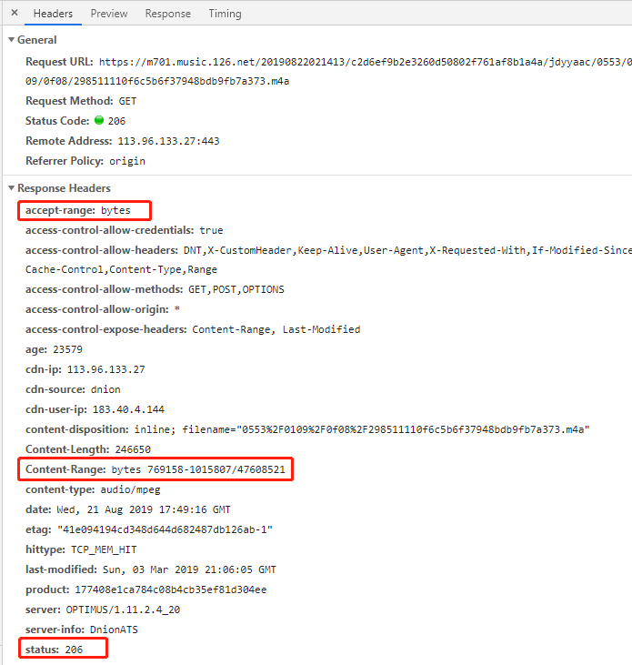

## HTTP 之 Range

1、什么是Range?

当用户在听一首歌的时候，如果听到一半（网络下载了一半），网络断掉了，用户需要继续听的时候，文件服务器不支持断点的话，则用户需要重新下载这个文件。
而Range支持的话，客户端应该记录了之前已经读取的文件范围，网络恢复之后，则向服务器发送读取剩余Range的请求，服务端只需要发送客户端请求的那部分内容，
而不用整个文件发送回客户端，以此节省网络带宽。

2、HTTP1.1规范的Range是怎样一个约定呢？
如果Server支持Range，首先就要告诉客户端，咱支持Range，之后客户端才可能发起带Range的请求。

`response.setHeader('Accept-Ranges', 'bytes');`

Server通过请求头中的 `Range: bytes=0-xxx`来判断是否是做Range请求，
如果这个值存在而且有效，则只发回请求的那部分文件内容，响应的状态码变成206，表示Partial Content，并设置Content-Range。
如果无效，则返回416状态码，表明Request Range Not Satisfiable（https://www.w3.org/Protocols/rfc2616/rfc2616-sec10.html ）。
如果不包含Range的请求头，则继续通过常规的方式响应。

下面以网易云音乐为例：

 