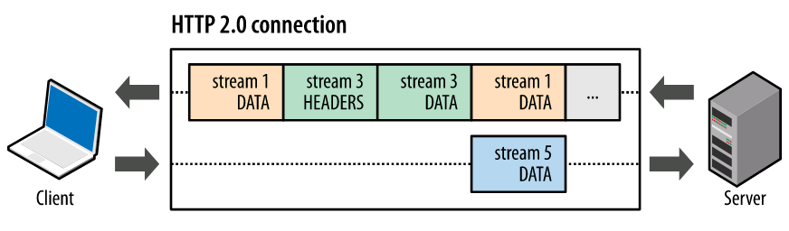
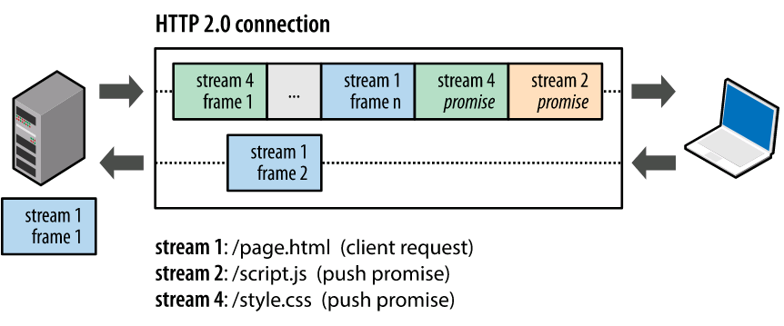

# HTTP/2 简介

> :star: Note:以下内容来自 [网络基础](https://developers.google.com/web/fundamentals/performance/http2/?hl=zh-cn)

HTTP/2 可以让我们的应用更快、更简单、更稳定 - 这几词凑到一块是很罕见的！HTTP/2 将很多以前我们在应用中针对 HTTP/1.1 想出来的“歪招儿”一笔勾销，把解决那些问题的方案内置在了传输层中。不仅如此，它还为我们进一步优化应用和提升性能提供了全新的机会！

HTTP/2 的目的是通过支持完整的请求与响应复用来减少延迟，通过有效压缩 HTTP 标头字段将协议开销降至最低，同时增加对请求优先级和服务器推送的支持。为达成这些目标，HTTP/2 还给我们带来了大量其他协议层面的辅助实现，例如新的流控制、错误处理和升级机制。上述几种机制虽然不是全部，但却是最重要的，每一位网络开发者都应该理解并在自己的应用中加以利用。

HTTP/2 没有改动 HTTP 的应用语义。HTTP 方法、状态代码、URI 和标头字段等核心概念一如往常。不过，HTTP/2 修改了数据格式化（分帧）以及在客户端与服务器间传输的方式。这两点统帅全局，通过新的分帧层向我们的应用隐藏了所有复杂性。因此，所有现有的应用都可以不必修改而在新协议下运行。

为什么不是 HTTP/1.2？

为了实现 HTTP 工作组设定的性能目标，HTTP/2 引入了一个新的二进制分帧层，该层无法与之前的 HTTP/1.x 服务器和客户端向后兼容，因此协议的主版本提升到 HTTP/2。

即便如此，除非您在实现网络服务器（或自定义客户端），需要使用原始的 TCP 套接字，否则您很可能注意不到任何区别：所有新的低级分帧由客户端和服务器为您执行。可观察到的唯一区别将是性能的提升和请求优先级、流控制与服务器推送等新功能的出现。

#SPDY 与 HTTP/2 简史
SPDY 是 Google 开发的一个实验性协议，于 2009 年年中发布，其主要目标是通过解决 HTTP/1.1 中广为人知的一些性能限制来减少网页的加载延迟。具体来说，这个项目设定的目标如下：

- 页面加载时间 (PLT) 减少 50%。
- 无需网站作者修改任何内容。
- 将部署复杂性降至最低，无需变更网络基础设施。
- 与开源社区合作开发这个新协议。
- 收集真实性能数据，验证这个实验性协议是否有效。

> :star: Note: 为了达到减少 50% 页面加载时间的目标，SPDY 引入了一个新的二进制分帧层，以实现请求和响应复用、优先级和标头压缩，目的是更有效地利用底层 TCP 连接；请参阅[延迟是性能瓶颈](https://hpbn.co/primer-on-web-performance/#latency-as-a-performance-bottleneck)

# 设计和技术目标
早期版本的 HTTP 协议的设计初衷主要是实现要简单： HTTP/0.9 只用一行协议就启动了万维网；HTTP/1.0 则是对流行的 HTTP/0.9 扩展的一个正式说明；HTTP 1.1 则是 IETF 的一份官方标准；请参阅 [HTTP 简史](https://hpbn.co/brief-history-of-http/)。因此，HTTP/0.9-1.x 只描述了现实是怎么一回事：HTTP 是应用最广泛、采用最多的一个互联网应用协议。

然而，实现简单是以牺牲应用性能为代价的： HTTP/1.x 客户端需要使用多个连接才能实现并发和缩短延迟；HTTP/1.x 不会压缩请求和响应标头，从而导致不必要的网络流量；HTTP/1.x 不支持有效的资源优先级，致使底层 TCP 连接的利用率低下；等等。

这些限制并不是致命的，但是随着网络应用的范围、复杂性以及在我们日常生活中的重要性不断增大，它们对网络开发者和用户都造成了巨大负担，而这正是 HTTP/2 要致力于解决的：

> HTTP/2 通过支持标头字段压缩和在同一连接上进行多个并发交换，让应用更有效地利用网络资源，减少感知的延迟时间。具体来说，它可以对同一连接上的请求和响应消息进行交错发送并为 HTTP 标头字段使用有效编码。 HTTP/2 还允许为请求设置优先级，让更重要的请求更快速地完成，从而进一步提升性能。出台的协议对网络更加友好，因为与 HTTP/1.x 相比，可以使用更少的 TCP 连接。
>  
>  这意味着与其他流的竞争减小，并且连接的持续时间变长，这些特性反过来提高了可用网络容量的利用率。 最后，HTTP/2 还可以通过使用二进制消息分帧对消息进行更高效的处理。

需要注意的是，HTTP/2 仍是对之前 HTTP 标准的扩展，而非替代。 HTTP 的应用语义不变，提供的功能不变，HTTP 方法、状态代码、URI 和标头字段等这些核心概念也不变。这些方面的变化都不在 HTTP/2 考虑之列。 虽然高级 API 保持不变，仍有必要了解低级变更如何解决了之前协议的性能限制。我们来简单了解一下二进制分帧层及其功能。

# 二进制分帧层
HTTP/2 所有性能增强的核心在于新的二进制分帧层，它定义了如何封装 HTTP 消息并在客户端与服务器之间传输。

这里所谓的“层”，指的是位于套接字接口与应用可见的高级 HTTP API 之间一个经过优化的新编码机制：HTTP 的语义（包括各种动词、方法、标头）都不受影响，不同的是传输期间对它们的编码方式变了。HTTP/1.x 协议以换行符作为纯文本的分隔符，而 HTTP/2 将所有传输的信息分割为更小的消息和帧，并采用二进制格式对它们编码。

这样一来，客户端和服务器为了相互理解，都必须使用新的二进制编码机制：HTTP/1.x 客户端无法理解只支持 HTTP/2 的服务器，反之亦然。不过不要紧，现有的应用不必担心这些变化，因为客户端和服务器会替我们完成必要的分帧工作。

# 数据流、消息和帧

新的二进制分帧机制改变了客户端与服务器之间交换数据的方式。 为了说明这个过程，我们需要了解 HTTP/2 的三个概念：

- 数据流：已建立的连接内的双向字节流，可以承载一条或多条消息。
- 消息：与逻辑请求或响应消息对应的完整的一系列帧。
- 帧：HTTP/2 通信的最小单位，每个帧都包含帧头，至少也会标识出当前帧所属的数据流。

这些概念的关系总结如下：
- 所有通信都在一个 TCP 连接上完成，此连接可以承载任意数量的双向数据流。
- 每个数据流都有一个唯一的标识符和可选的优先级信息，用于承载双向消息。
- 每条消息都是一条逻辑 HTTP 消息（例如请求或响应），包含一个或多个帧。
- 帧是最小的通信单位，承载着特定类型的数据，例如 HTTP 标头、消息负载，等等。 来自不同数据流的帧可以交错发送，然后再根据每个帧头的数据流标识符重新组装。

简言之，HTTP/2 将 HTTP 协议通信分解为二进制编码帧的交换，这些帧对应着特定数据流中的消息。所有这些都在一个 TCP 连接内复用。这是 HTTP/2 协议所有其他功能和性能优化的基础。

# 请求与相应复用
在 HTTP/1.x 中，如果客户端要想发起多个并行请求以提升性能，则必须使用多个 TCP 连接（请参阅[使用多个 TCP 连接](https://hpbn.co/http1x/#using-multiple-tcp-connections)）。这是 HTTP/1.x 交付模型的直接结果，该模型可以保证每个连接每次只交付一个响应（响应排队）。更糟糕的是，这种模型也会导致队首阻塞，从而造成底层 TCP 连接的效率低下。

HTTP/2 中新的二进制分帧层突破了这些限制，实现了完整的请求和响应复用：客户端和服务器可以将 HTTP 消息分解为互不依赖的帧，然后交错发送，最后再在另一端把它们重新组装起来。

快照捕捉了同一个连接内并行的多个数据流。客户端正在向服务器传输一个 DATA 帧（数据流 5），与此同时，服务器正向客户端交错发送数据流 1 和数据流 3 的一系列帧。因此，一个连接上同时有三个并行数据流。

将 HTTP 消息分解为独立的帧，交错发送，然后在另一端重新组装是 HTTP 2 最重要的一项增强。事实上，这个机制会在整个网络技术栈中引发一系列连锁反应，从而带来巨大的性能提升，让我们可以：

- 并行交错地发送多个请求，请求之间互不影响。
- 并行交错地发送多个响应，响应之间互不干扰。
- 使用一个连接并行发送多个请求和响应。
- 不必再为绕过 HTTP/1.x 限制而做很多工作（请参阅针对 HTTP/1.x 进行优化，例如级联文件、image sprites 和域名分片。
- 消除不必要的延迟和提高现有网络容量的利用率，从而减少页面加载时间。
- 等等…

HTTP/2 中的新二进制分帧层解决了 HTTP/1.x 中存在的队首阻塞问题，也消除了并行处理和发送请求及响应时对多个连接的依赖。结果，应用速度更快、开发更简单、部署成本更低。

# 数据流优先级
将 HTTP 消息分解为很多独立的帧之后，我们就可以复用多个数据流中的帧，客户端和服务器交错发送和传输这些帧的顺序就成为关键的性能决定因素。为了做到这一点，HTTP/2 标准允许每个数据流都有一个关联的权重和依赖关系：

- 可以向每个数据流分配一个介于 1 至 256 之间的整数。
- 每个数据流与其他数据流之间可以存在显式依赖关系。

数据流依赖关系和权重的组合让客户端可以构建和传递“优先级树”，表明它倾向于如何接收响应。反过来，服务器可以使用此信息通过控制 CPU、内存和其他资源的分配设定数据流处理的优先级，在资源数据可用之后，带宽分配可以确保将高优先级响应以最优方式传输至客户端。

# 每个来源一个连接
有了新的分帧机制后，HTTP/2 不再依赖多个 TCP 连接去并行复用数据流；每个数据流都拆分成很多帧，而这些帧可以交错，还可以分别设定优先级。因此，所有 HTTP/2 连接都是永久的，而且仅需要每个来源一个连接，随之带来诸多性能优势。

> SPDY 和 HTTP/2 的杀手级功能是，可以在一个拥塞受到良好控制的通道上任意进行复用。 这一功能的重要性和良好运行状况让我吃惊。 我喜欢的一个非常不错的指标是连接拆分，这些拆分仅承载一个 HTTP 事务（并因此让该事务承担所有开销）。 对于 HTTP/1，我们 74% 的活动连接仅承载一个事务 - 永久连接并不如我们所有人希望的那般有用。 但是在 HTTP/2 中，这一比例锐减至 25%。

大多数 HTTP 传输都是短暂且急促的，而 TCP 则针对长时间的批量数据传输进行了优化。 通过重用相同的连接，HTTP/2 既可以更有效地利用每个 TCP 连接，也可以显著降低整体协议开销。不仅如此，使用更少的连接还可以减少占用的内存和处理空间，也可以缩短完整连接路径（即，客户端、可信中介和源服务器之间的路径）这降低了整体运行成本并提高了网络利用率和容量。 因此，迁移到 HTTP/2 不仅可以减少网络延迟，还有助于提高通量和降低运行成本。

> :star: Note: 连接数量减少对提升 HTTPS 部署的性能来说是一项特别重要的功能：可以减少开销较大的 TLS 连接数、提升会话重用率，以及从整体上减少所需的客户端和服务器资源。

# 流控制
流控制是一种阻止发送方向接收方发送大量数据的机制，以免超出后者的需求或处理能力：发送方可能非常繁忙、处于较高的负载之下，也可能仅仅希望为特定数据流分配固定量的资源。例如，客户端可能请求了一个具有较高优先级的大型视频流，但是用户已经暂停视频，客户端现在希望暂停或限制从服务器的传输，以免提取和缓冲不必要的数据。再比如，一个代理服务器可能具有较快的下游连接和较慢的上游连接，并且也希望调节下游连接传输数据的速度以匹配上游连接的速度来控制其资源利用率；等等。

上述要求会让您想到 TCP 流控制吗？您应当想到这一点；因为问题基本相同（请参阅[流控制](https://hpbn.co/building-blocks-of-tcp/#flow-control)）。不过，由于 HTTP/2 数据流在一个 TCP 连接内复用，TCP 流控制既不够精细，也无法提供必要的应用级 API 来调节各个数据流的传输。为了解决这一问题，HTTP/2 提供了一组简单的构建块，这些构建块允许客户端和服务器实现其自己的数据流和连接级流控制：
- 流控制具有方向性。每个接收方都可以根据自身需要选择为每个数据流和整个连接设置任意的窗口大小。
- 流控制基于信用。每个接收方都可以公布其初始连接和数据流流控制窗口（以字节为单位），每当发送方发出 DATA 帧时都会减小，在接收方发出 WINDOW_UPDATE 帧时增大。
- 流控制无法停用。建立 HTTP/2 连接后，客户端将与服务器交换 SETTINGS 帧，这会在两个方向上设置流控制窗口。流控制窗口的默认值设为 65,535 字节，但是接收方可以设置一个较大的最大窗口大小（2^31-1 字节），并在接收到任意数据时通过发送 WINDOW_UPDATE 帧来维持这一大小。
- 流控制为逐跃点控制，而非端到端控制。即，可信中介可以使用它来控制资源使用，以及基于自身条件和启发式算法实现资源分配机制。

HTTP/2 未指定任何特定算法来实现流控制。不过，它提供了简单的构建块并推迟了客户端和服务器实现，可以实现自定义策略来调节资源使用和分配，以及实现新传输能力，同时提升网络应用的实际性能和感知性能。

例如，应用层流控制允许浏览器仅提取一部分特定资源，通过将数据流流控制窗口减小为零来暂停提取，稍后再行恢复。换句话说，它允许浏览器提取图像预览或首次扫描结果，进行显示并允许其他高优先级提取继续，然后在更关键的资源完成加载后恢复提取。

# 服务器推送
HTTP/2 新增的另一个强大的新功能是，服务器可以对一个客户端请求发送多个响应。 换句话说，除了对最初请求的响应外，服务器还可以向客户端推送额外资源（图 12-5），而无需客户端明确地请求。

为什么在浏览器中需要一种此类机制呢？一个典型的网络应用包含多种资源，客户端需要检查服务器提供的文档才能逐个找到它们。那为什么不让服务器提前推送这些资源，从而减少额外的延迟时间呢？服务器已经知道客户端下一步要请求什么资源，这时候服务器推送即可派上用场。

事实上，如果您在网页中内联过 CSS、JavaScript，或者通过数据 URI 内联过其他资产（请参阅资源内联），那么您就已经亲身体验过服务器推送了。对于将资源手动内联到文档中的过程，我们实际上是在将资源推送给客户端，而不是等待客户端请求。使用 HTTP/2，我们不仅可以实现相同结果，还会获得其他性能优势。 推送资源可以进行以下处理：

- 由客户端缓存
- 在不同页面之间重用
- 与其他资源一起复用
- 由服务器设定优先级
- 被客户端拒绝
## PUSH_PROMISE 101
所有服务器推送数据流都由 PUSH_PROMISE 帧发起，表明了服务器向客户端推送所述资源的意图，并且需要先于请求推送资源的响应数据传输。这种传输顺序非常重要：客户端需要了解服务器打算推送哪些资源，以免为这些资源创建重复请求。满足此要求的最简单策略是先于父响应（即，DATA 帧）发送所有 PUSH_PROMISE 帧，其中包含所承诺资源的 HTTP 标头。

在客户端接收到 PUSH_PROMISE 帧后，它可以根据自身情况选择拒绝数据流（通过 RST_STREAM 帧）。 （如果资源已经位于缓存中，可能会发生这种情况。） 这是一个相对于 HTTP/1.x 的重要提升。 相比之下，使用资源内联（一种受欢迎的 HTTP/1.x“优化”）等同于“强制推送”：客户端无法选择拒绝、取消或单独处理内联的资源。

使用 HTTP/2，客户端仍然完全掌控服务器推送的使用方式。客户端可以限制并行推送的数据流数量；调整初始的流控制窗口以控制在数据流首次打开时推送的数据量；或完全停用服务器推送。这些优先级在 HTTP/2 连接开始时通过 SETTINGS 帧传输，可能随时更新。

推送的每个资源都是一个数据流，与内嵌资源不同，客户端可以对推送的资源逐一复用、设定优先级和处理。 浏览器强制执行的唯一安全限制是，推送的资源必须符合原点相同这一政策：服务器对所提供内容必须具有权威性。

# 标头压缩
每个 HTTP 传输都承载一组标头，这些标头说明了传输的资源及其属性。 在 HTTP/1.x 中，此元数据始终以纯文本形式，通常会给每个传输增加 500–800 字节的开销。如果使用 HTTP Cookie，增加的开销有时会达到上千字节。（请参阅测量和控制协议开销。）为了减少此开销和提升性能，HTTP/2 使用 HPACK 压缩格式压缩请求和响应标头元数据，这种格式采用两种简单但是强大的技术：

- 这种格式支持通过静态 Huffman 代码对传输的标头字段进行编码，从而减小了各个传输的大小。
- 这种格式要求客户端和服务器同时维护和更新一个包含之前见过的标头字段的索引列表（换句话说，它可以建立一个共享的压缩上下文），此列表随后会用作参考，对之前传输的值进行有效编码。

利用 Huffman 编码，可以在传输时对各个值进行压缩，而利用之前传输值的索引列表，我们可以通过传输索引值的方式对重复值进行编码，索引值可用于有效查询和重构完整的标头键值对。

作为一种进一步优化方式，HPACK 压缩上下文包含一个静态表和一个动态表：静态表在规范中定义，并提供了一个包含所有连接都可能使用的常用 HTTP 标头字段（例如，有效标头名称）的列表；动态表最初为空，将根据在特定连接内交换的值进行更新。因此，为之前未见过的值采用静态 Huffman 编码，并替换每一侧静态表或动态表中已存在值的索引，可以减小每个请求的大小。

> :star: Note: 在 HTTP/2 中，请求和响应标头字段的定义保持不变，仅有一些微小的差异：所有标头字段名称均为小写，请求行现在拆分成各个 :method、:scheme、:authority 和 :path 伪标头字段。

## HPACK 的安全性和性能
早期版本的 HTTP/2 和 SPDY 使用 zlib（带有一个自定义字典）压缩所有 HTTP 标头。 这种方式可以将所传输标头数据的大小减小 85% - 88%，显著减少了页面加载时间延迟：

> 在带宽较低的 DSL 链路中，上行链路速度仅有 375 Kbps，仅压缩请求标头就显著减少了特定网站（即，发出大量资源请求的网站）的页面加载时间。 我们发现，仅仅由于标头压缩，页面加载时间就减少了 45 - 1142 毫秒。（[SPDY 白皮书，chromium.org](https://www.chromium.org/spdy/spdy-whitepaper)）

然而，2012 年夏天，出现了针对 TLS 和 SPDY 压缩算法的“犯罪”安全攻击，此攻击会导致会话被劫持。 于是，zlib 压缩算法被 HPACK 替代，后者经过专门设计，可以解决发现的安全问题、实现起来也更高效和简单，当然，可以对 HTTP 标头元数据进行良好压缩。

如需了解有关 HPACK 压缩算法的完整详情，请参阅 [https://tools.ietf.org/html/draft-ietf-httpbis-header-compression](https://tools.ietf.org/html/draft-ietf-httpbis-header-compression)。